# Googleアカウント作成手順

本手順書ではGoogleアカウント作成手順について記述する。  
Googleアカウントは後に実施するGlide初期設定、GoogleColab動作確認、Python公式チュートリアルの学習、Glideサンプルアプリの作成にて必要な為、事前に準備しておく。

## 注意事項
既にGoogleアカウントを持っている場合は本手順は不要  

## 目次
[**１ 基本情報の入力**](#１-基本情報の入力)  
[**２ Gmailアドレスの選択**](#２-gmailアドレスの選択)  
[**３ パスワード及び電話番号の設定**](#３-パスワード及び電話番号の設定)  
[**４ 登録アカウント情報の確認**](#４-登録アカウント情報の確認)  
[**５ プライバシーと利用規約の同意**](#５-プライバシーと利用規約の同意)  
[**６ アカウント作成完了**](#６-アカウント作成完了)  

## １ 基本情報の入力

1. [Googleアカウントページ](https://www.google.com/intl/ja/account/about/)に移動  
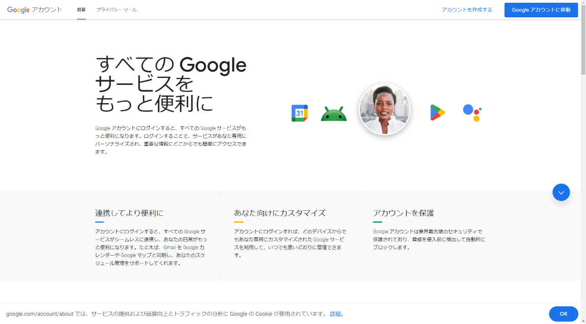

2. 「アカウントを作成する」をクリック  
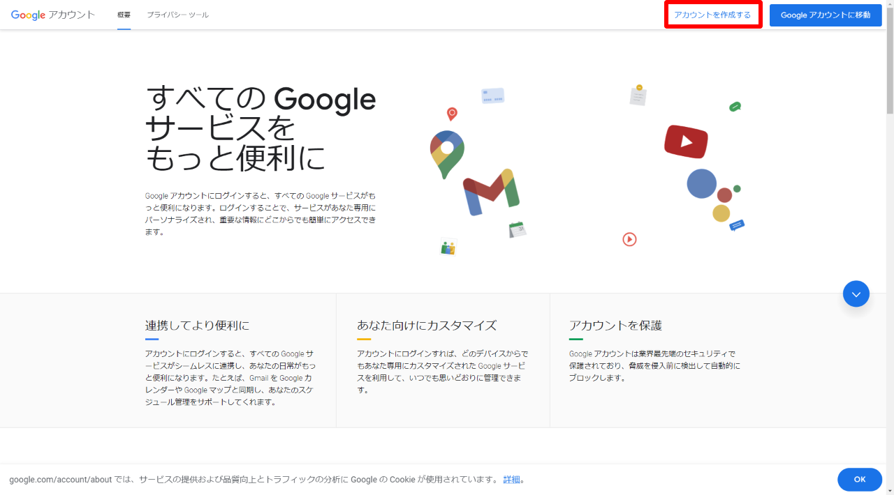

3. 以下の情報を入力して「次へ」をクリック  
    - 姓（省略可）  
    - 名  
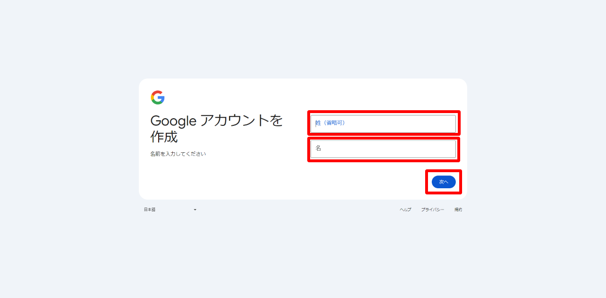

4. 以下の情報を入力して「次へ」をクリック  
    - 生年月日  
    - 性別  
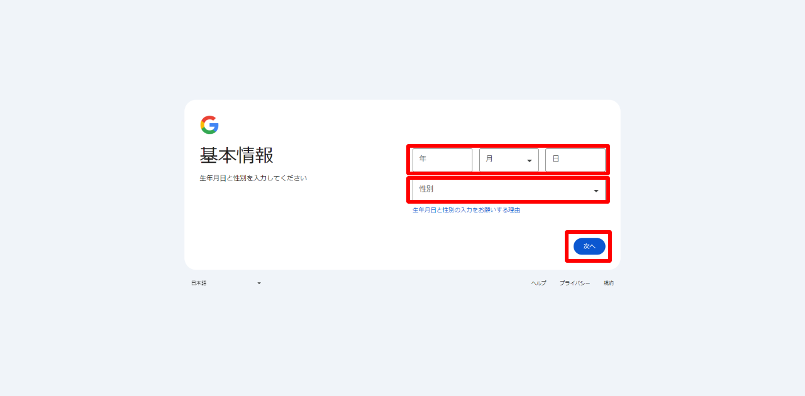

## ２ Gmailアドレスの選択

### Google発行のGmailアドレスを使用する場合

Googleから発行されたGmailアドレスを選択する  
    該当のGmailアドレスを選択して「次へ」をクリック  
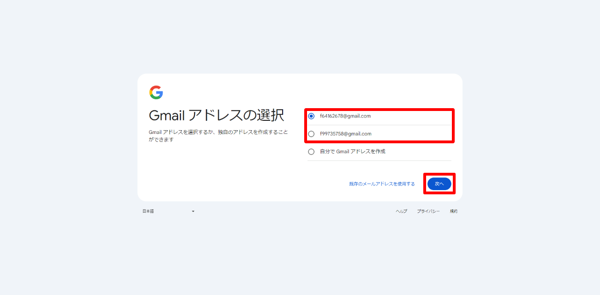  

### 自分でGmailアドレスを作成する

「自分でGmailアドレスを作成」を選択後、Gmailアドレスを入力して「次へ」をクリック  
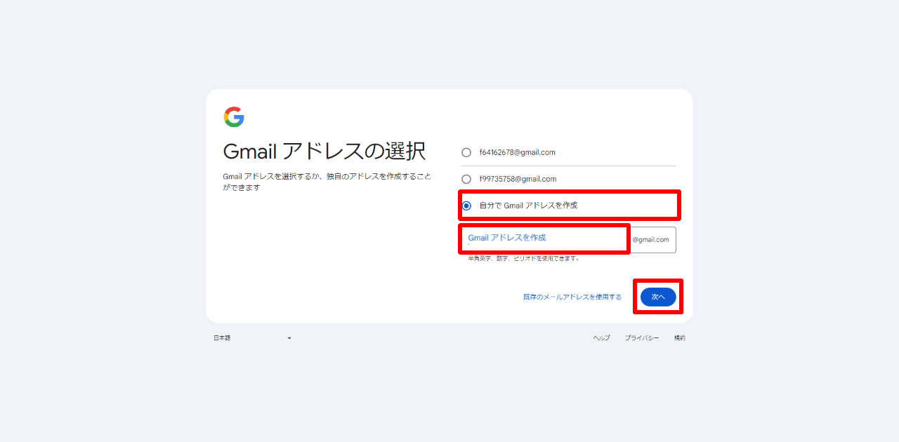  

### 既存のメールアドレスを使用する

1. 「既存のメールアドレスを使用する」をクリック  
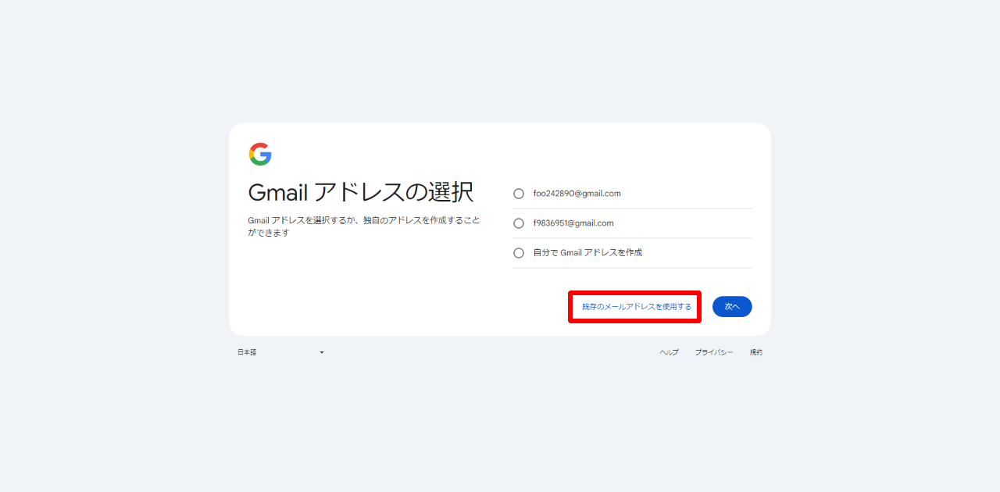  
2. メールアドレスを入力して「次へ」をクリック  
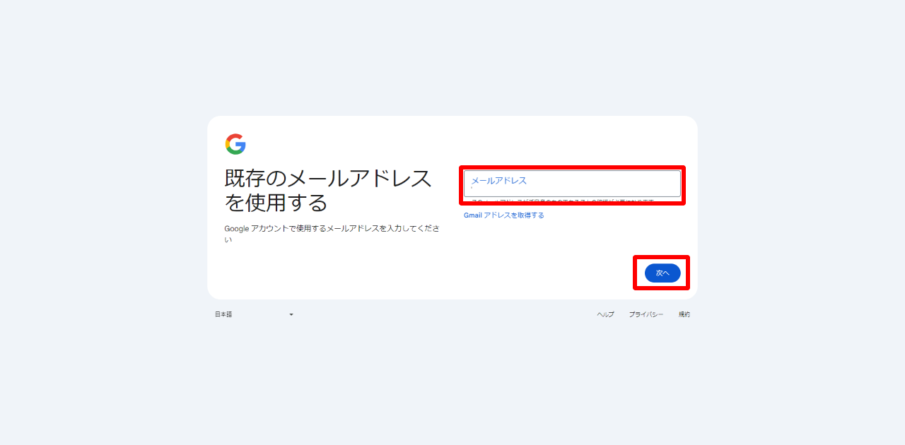  
3. 入力したメールアドレス宛に届いた確認コードを入力して「次へ」をクリック  
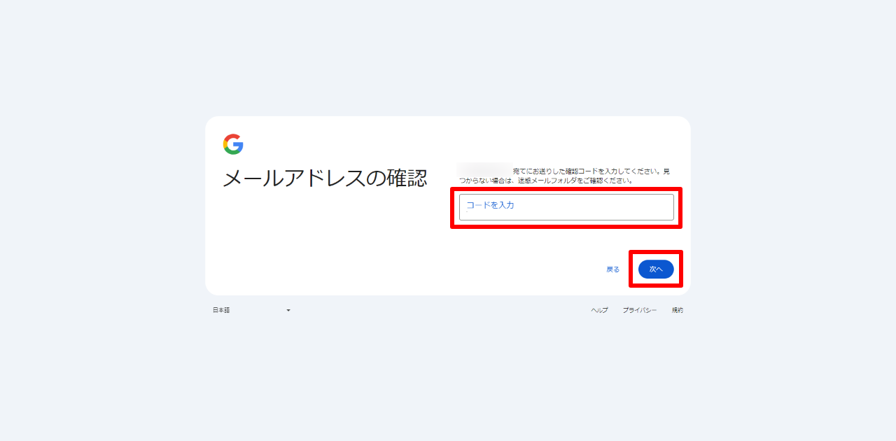  

## ３ パスワード及び電話番号の設定

1. 任意のパスワードと確認欄に同じパスワードを入力して「次へ」をクリック  
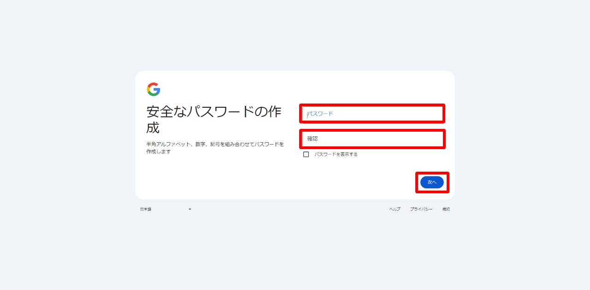

2. 携帯の電話番号を入力して「次へ」をクリック  
※ロボットによる操作でないことを証明する為にSMSによる確認が必要  
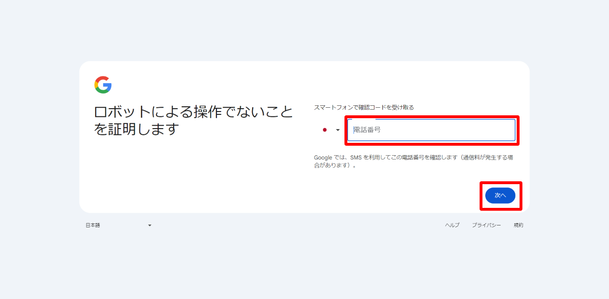

3. 入力した電話番号宛に届いた確認コードを入力して「次へ」をクリック  
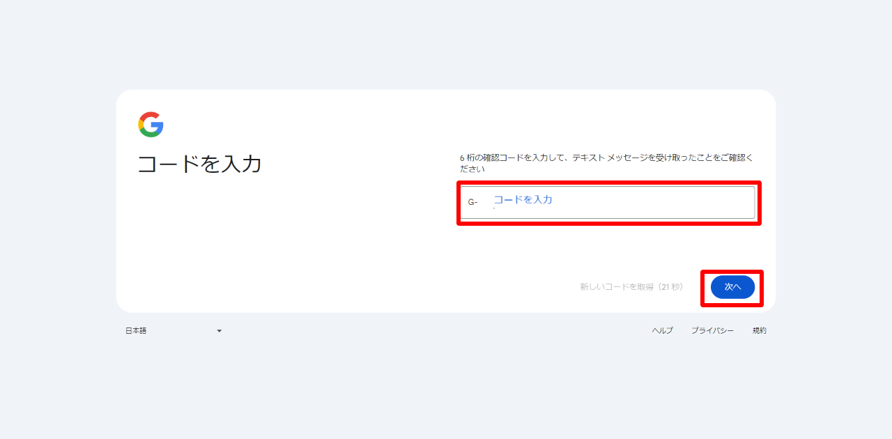

4. 再設定用のメールアドレスを追加したい場合、ここで入力して「次へ」をクリック  
**※既存のメールアドレスを使用する以外の場合のみ**  
※再設定用のメールアドレスの追加が不要の場合は「スキップ」ボタンをクリック
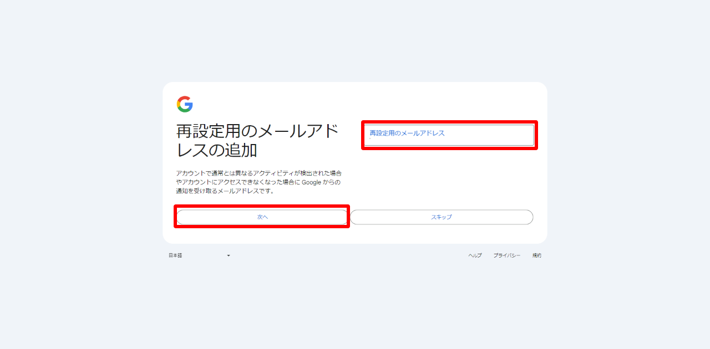  

1. セキュリティ保護のために電話番号を追加したい場合、ここで入力して「次へ」をクリック  
**※既存のメールアドレスを使用する場合のみ**  
※電話番号の追加が不要の場合は「スキップ」ボタンをクリック
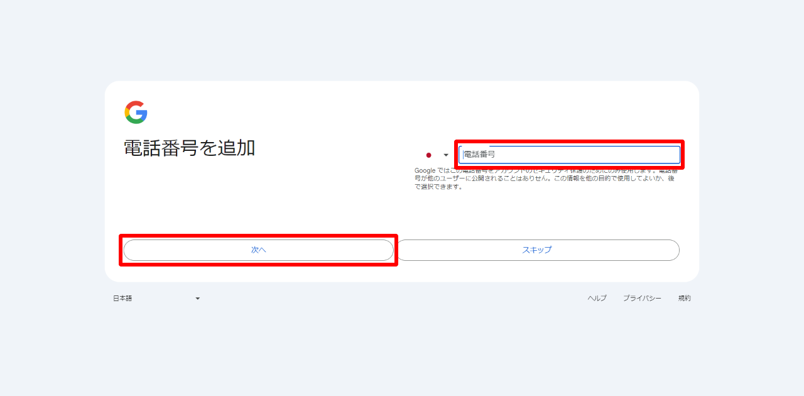  

## ４ 登録アカウント情報の確認

登録したアカウント情報を確認して「次へ」をクリック  
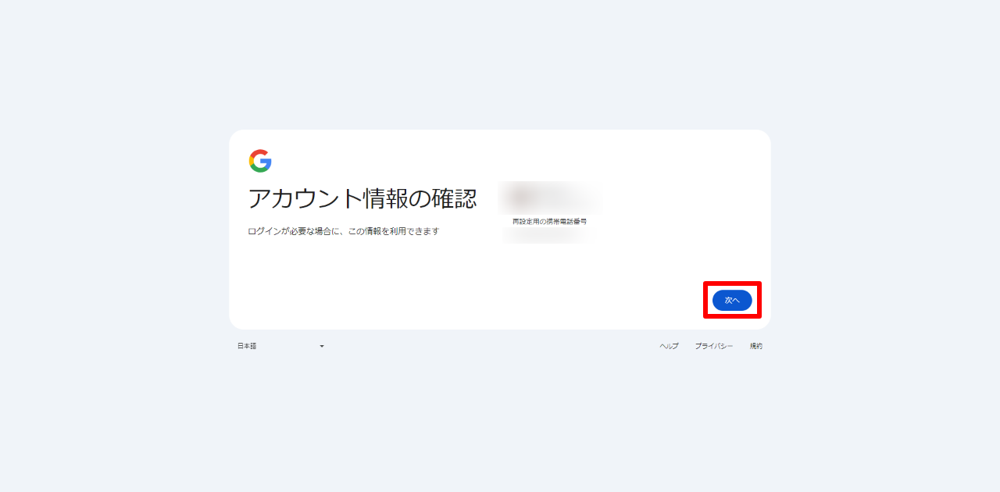  

## ５ プライバシーと利用規約の同意
プライバシーと利用規約を確認の上、最下部にある「同意する」をクリック  
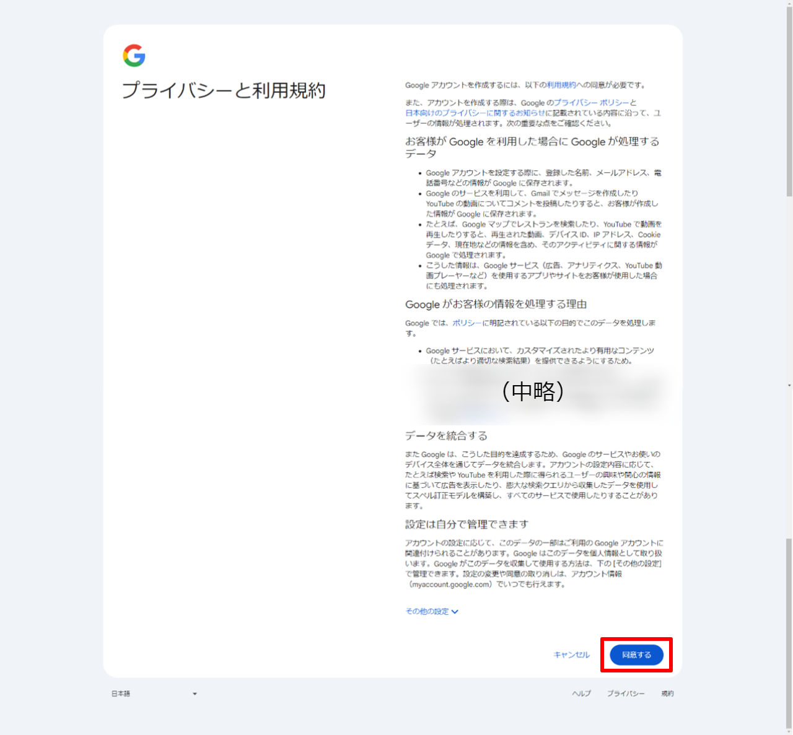  

## ６ アカウント作成完了
アカウントの作成が完了すると、Googleアカウントのホーム画面が表示される  
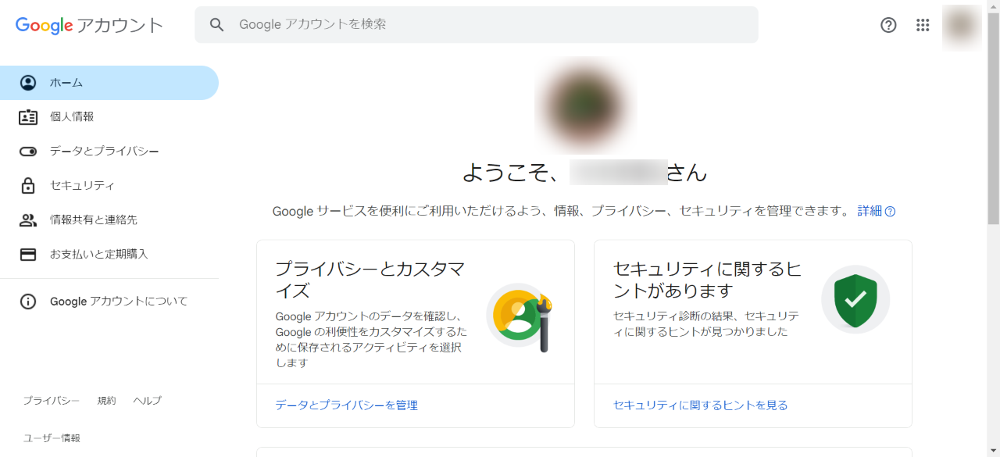  
