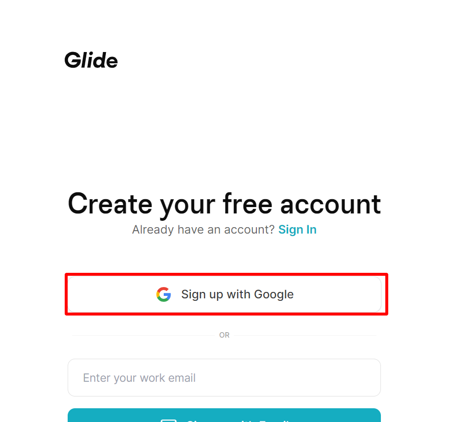
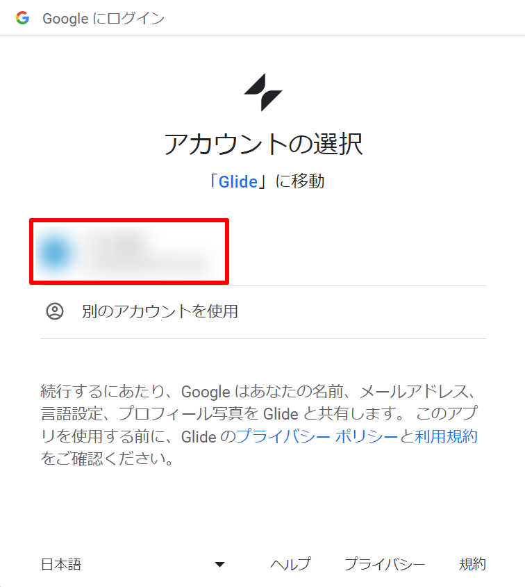
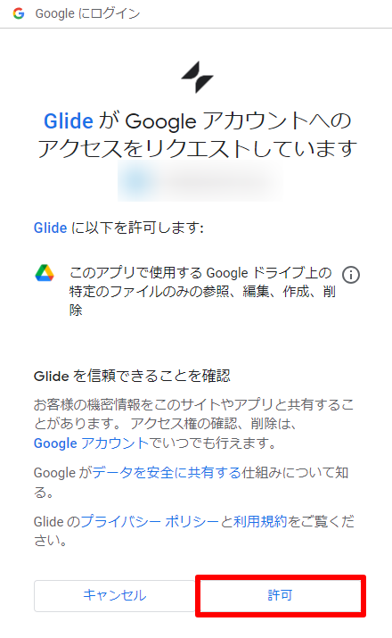
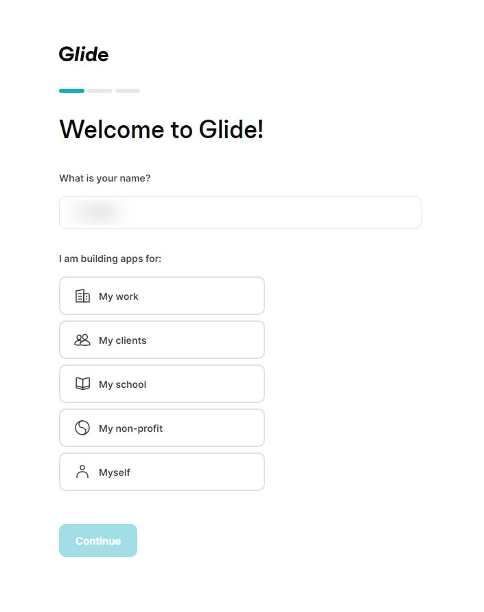
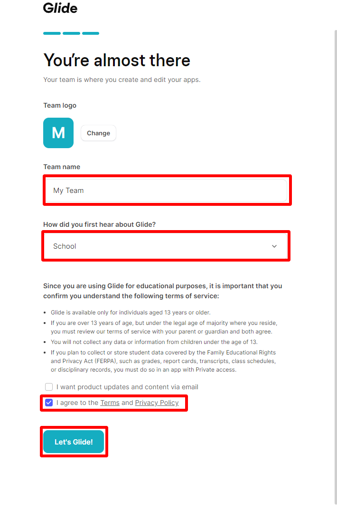
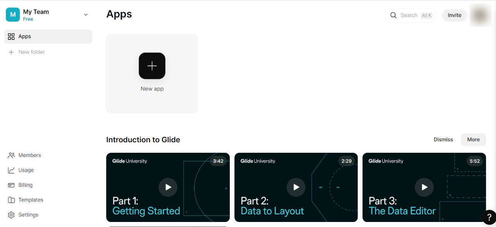

# Glide初期設定手順

本手順書ではGlide初期設定手順について記述する。  
Glideは演習の中でアプリケーションを作成する際に必要となる為、事前に準備をしておく。

## 注意事項
事前にGoogleアカウントの作成が必要 ([Googleアカウント作成手順](Googleアカウント作成手順.md))  
講義に使用するGoogleアカウントで既にGlideアカウントを持っている場合は本手順は不要

## 目次
[**１ アカウント作成**](#１-アカウント作成)  
- [Googleアカウントを使用してGlideアカウントを作成](#googleアカウントを使用してglideアカウントを作成)  

[**２ 初期設定**](#２-初期設定)  
- [ユーザー情報の入力](#ユーザー情報の入力)  
- [チーム情報などの入力](#チーム情報などの入力)  
- [初期設定完了](#初期設定完了)  

## １ アカウント作成

### Googleアカウントを使用してGlideアカウントを作成
1. [Glide公式ページ](https://www.glideapps.com/)に移動  

2. 右上の「Sign Up」をクリック  

3. 「Sign up with Google」をクリック  
**※[Googleアカウント作成手順](Googleアカウント作成手順.md)で作成済のGoogleアカウントを使ってアカウントを作成**  
  

4. Googleのログイン画面が表示されるので対象のアカウントを選択  
  

5. パスワード入力画面が表示されるのでパスワードを入力して「次へ」をクリック  
**※Googleアカウントにログイン済の場合は本手順は不要**  
  

6. GoogleアカウントのGlideへの共有情報の画面が表示されるので「次へ」をクリック  
  

7. GlideのGoogleアカウントへのアクセス許可画面が表示されるので「許可」をクリック  
  

8. アカウントの作成完了  
アカウントの作成が完了すると、初期設定画面が表示される  
  

## ２ 初期設定

### ユーザー情報の入力
名前、使用目的、その他情報を入力して「continue」をクリック  

1. 使用目的は「My school」を選択  

2. その他情報は「I am a student or teacher」を選択  

  

### チーム情報などの入力
チーム情報、Glideを知ったきっかけ、規約同意を入力して「Let's Glide」をクリック  

1. チーム名は「My Team」を入力  

2. Glideを知ったきっかけは「School」を選択  

3. 最後にあるチェックボックス(I agree to the Terms and Privacy Policy)にチェック  
4. 「Let's Glide」をクリック  
  

### 初期設定完了
初期設定が完了すると、Glideのホーム画面が表示される  
  