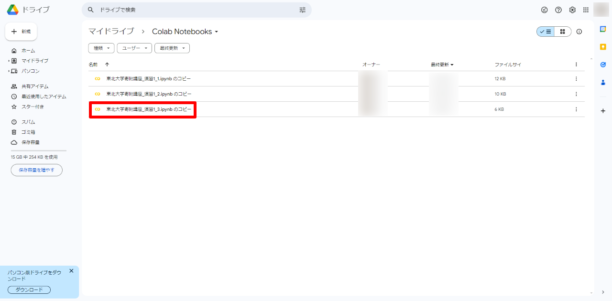

---
pdf_options:
  format: A4
  margin: 10mm
body_class: markdown-body
css: |-
  .markdown-body { font-size: 16px; }
  .markdown-body img {
    max-width: 600px;
    max-height: 400px;
  }
---

# GoogleColaboratory動作確認手順

本手順書ではGoogleColaboratory動作確認手順について記述する。  
GoogleColaboratoryとはGoogle社が提供している、ブラウザから直接Pythonを記述、実行できるサービス。  
演習1-1 ～ 演習1-3 ではGoogleColaboratoryを使用して各種プログラムを実行する為、その流れを説明する。

## 目次
[**１ 演習用コンテンツコピー先の確認**](#１-演習用コンテンツコピー先の確認)  
[**２ 演習用コンテンツのコピー**](#２-演習用コンテンツのコピー)  
[**３ 動作確認の実施**](#３-動作確認の実施)  

## １ 演習用コンテンツコピー先の確認  
事前にファイルのコピー先を確認する為、Googleドライブを開く  
1. [Googleトップ画面](https://www.google.com/)でログインボタンをクリック  
  

2. 対象のGoogleアカウントを選択  
  

3. パスワードを入力して「次へ」をクリック  
  

4. ログインが成功するとGoogleトップ画面が表示される  
  

5. 右上のアイコンを選択し、「ドライブ」をクリック  
  

6. Googleドライブが表示されるので「マイドライブ」をクリック  
※後続の手順実施後にこの場所に演習用コンテンツがコピーされる  
  

## ２ 演習用コンテンツのコピー  
1. [演習1-1 のコンテンツ](https://colab.research.google.com/drive/16Ze3yhw9cdOP_wLf_GWrOba7AlwznmlZ?usp=sharing)に移動  
  

2. 「ドライブにコピー」をクリックし、自分のGoogleドライブにコピー  
    ※東北大学寄附講座_演習1_1.ipynb のコピー というファイルが生成される  
  

3. コピーが完了すると「東北大学寄附講座_演習1_1.ipynb のコピー」が開かれる  
  

4. Googleドライブのマイドライブ上に「Colab Notebooks」フォルダが作成されていることを確認  
  

5. Colab Notebooksフォルダ内に「東北大学寄附講座_演習1_1.ipynb のコピー」が存在することを確認  
  

6. [演習1-2 のコンテンツ](https://colab.research.google.com/drive/1yyO55DDFfIy_p6vojC3dL0W2_MbZP5fX?usp=sharing)に移動  
  

7. 「ドライブにコピー」をクリックし、自分のGoogleドライブにコピー  
    ※東北大学寄附講座_演習1_2.ipynb のコピー というファイルが生成される  
  

8. コピーが完了すると「東北大学寄附講座_演習1_2.ipynb のコピー」が開かれる  
  

9. 4で作成された「Colab Notebooks」内に「東北大学寄附講座_演習1_2.ipynb のコピー」が存在することを確認  
  

10. [演習1-3 のコンテンツ](https://colab.research.google.com/drive/1Tb-tSPsPODpPHIQd9t2LcGEVI0WMjBxc?usp=sharing)に移動  
  

11. 「ドライブにコピー」をクリックし、自分のGoogleドライブにコピー  
    ※東北大学寄附講座_演習1_3.ipynb のコピー というファイルが生成される  
  

12. コピーが完了すると「東北大学寄附講座_演習1_3.ipynb のコピー」が開かれる  
  

13. 4で作成された「Colab Notebooks」内に「東北大学寄附講座_演習1_3.ipynb のコピー」が存在することを確認  
  

14. 4で作成された「Colab Notebooks」内にコピーした3ファイルが存在することを確認  
    **※ここから使用するファイルは必ずコピーした3ファイルを使用すること**  
  

## ３ 動作確認の実施

### 演習1-1
1. 東北大学寄附講座_演習1_1.ipynb のコピー を開く  
※東北大学寄附講座_演習1_1.ipynbが開かれていない場合は、Googleドライブのマイドライブ内、「Colab Notebooks」フォルダから開く  
  

**(画面構成)**  
GoogleColaboratoryの画面構成を以下に記載する  
  
①プログラム記載セル（グレーで塗りつぶされたセル）  
②プログラム実行ボタン  
③説明  

2. プログラム実行  
プログラムが記載されているセルを確認し、左側のプログラム実行ボタンをクリック  
  

    ※初回実行時は少し時間がかかるので、画面右上のステータスが「RAMディスク」になるまで待機  
    
      

    1. 「接続」 → プログラム実行前  
    2. 「接続中」 → プログラム実行ボタンをクリック  
    3. 「接続済」 → プログラム実行準備完了  
    4. 「RAMディスク」 → プログラム実行開始  

3. 実行結果の確認  
プログラムが記載されたセルの下に、実行結果が表示されるので確認  
  

4. 演習1-1を進める  
手順 2、3 と同様の手順にて、プログラム実行までの説明を呼んだ上で、プログラムの動作確認を行う  
  

### 演習1-2

1. 東北大学寄附講座_演習1_2.ipynb のコピー を開く  
※東北大学寄附講座_演習1_2.ipynbが開かれていない場合はGoogleドライブのマイドライブ内、「Colab Notebooks」フォルダから開く  
  

2. プログラム実行  
プログラムが記載されているセルを確認し、左側のプログラム実行ボタンをクリック  
  

    ※初回実行時は少し時間がかかるので、画面右上のステータスが「RAMディスク」になるまで待機  
    
      

    1. 「接続」 → プログラム実行前  
    2. 「接続中」 → プログラム実行ボタンをクリック  
    3. 「接続済」 → プログラム実行準備完了  
    4. 「RAMディスク」 → プログラム実行開始  

3. 実行結果の確認  
プログラムが記載されたセルの下に、実行結果が表示されるので確認  
  

4. 演習1-2を進める  
手順 2、3 と同様の手順にて、プログラム実行までの説明を呼んだ上で、プログラムの動作確認を行う  
  

#### 補足
「SVMを用いた分類器の学習」セクションにて正答率は若干低下しているとの記載があるがテスト用データのパターンによっては正答率が高くなる場合もある  
  

### 演習1-3

1. 東北大学寄附講座_演習1_3.ipynb のコピー を開く  
※東北大学寄附講座_演習1_3.ipynbが開かれていない場合はGoogleドライブのマイドライブ内、「Colab Notebooks」フォルダから開く  
  

2. プログラム実行  
プログラムが記載されているセルを確認し、左側のプログラム実行ボタンをクリック  
  

    ※初回実行時は少し時間がかかるので、画面右上のステータスが「RAMディスク」になるまで待機  
    
      

    1. 「接続」 → プログラム実行前  
    2. 「接続中」 → プログラム実行ボタンをクリック  
    3. 「接続済」 → プログラム実行準備完了  
    4. 「RAMディスク」 → プログラム実行開始  

3. 実行結果の確認  
プログラムが記載されたセルの下に、実行結果が表示されるので確認  
  

4. OpenAIのAPIキーを設定  
「OpenAIのAPIキーを環境変数としてセット」のセクションで個人のAPIキーを設定する  
  

5. 演習1-3を進める  
手順 2、3 と同様の手順にて、プログラム実行までの説明を呼んだ上で、プログラムの動作確認を行う  
  