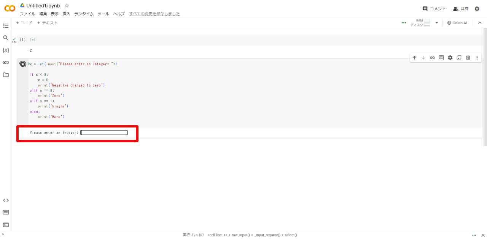
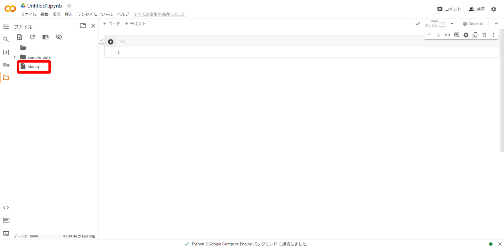
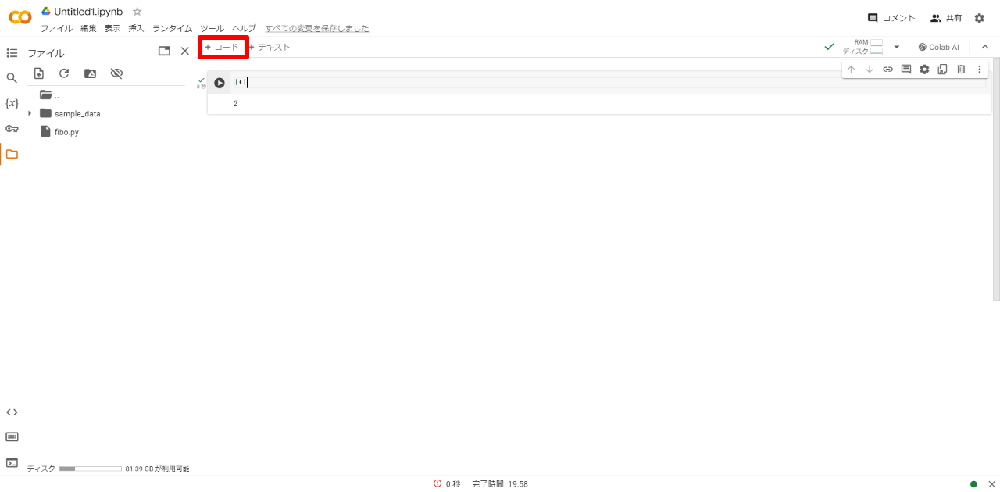

---
pdf_options:
  format: A4
  margin: 10mm
body_class: markdown-body
css: |-
  .markdown-body { font-size: 16px; }
  .markdown-body img {
    max-width: 600px;
    max-height: 400px;
  }
---

# Python公式チュートリアルの学習環境構築手順

本手順書ではPython公式チュートリアルの学習環境構築手順について記述する。  
Pythonは演習の中でも使用している為、本学習を通して事前に内容を把握することを目的としている。  
また、公式チュートリアル内のプログラムはGoogleColaboratoryにて進める為、その実行方法を説明する。  

## 目次
[**１ GoogleColaboratoryログイン**](#１-googlecolaboratoryログイン)  
[**２ ノートブックの作成**](#２-ノートブックの作成)  
[**３ Python公式チュートリアルの実施**](#３-python公式チュートリアルの実施)  
[**４ 他参考ドキュメント**](#４-他参考ドキュメント)  

## １ GoogleColaboratoryログイン
1. [GoogleColaboratory](https://colab.research.google.com/)のページへ移動  
  

2. 右上の「ログイン」をクリック  
  

3. 対象のGoogleアカウントを選択  
  

4. パスワードを入力して「次へ」をクリック  
  

5. ログインが成功するとGoogleColaboratoryの「ノートブックを開く」画面が表示される  
  

## ２ ノートブックの作成
チュートリアルに記載されているプログラムを実行する為に、ノートブックを作成する。  

1. 「ノートブックを新規作成」をクリック  
  

2. ノートブックが開く  
  

3. プログラムの動作を確認する為、セル内に `1+1` を入力  
  

4. 実行ボタンをクリック  
  

    ※初回実行時は少し時間がかかるので、画面右上のステータスが「RAMディスク」になるまで待機  
    
      

    1. 「接続」 → プログラム実行前  
    2. 「接続中」 → プログラム実行ボタンをクリック  
    3. 「接続済」 → プログラム実行準備完了  
    4. 「RAMディスク」 → プログラム実行開始  

5. プログラムの実行結果として、`2` という結果が表示されることを確認  
※公式チュートリアルではこの手順 3、4、5 を実施してプログラムの確認を行う  
  

## ３ Python公式チュートリアルの実施

[Python公式チュートリアル](https://docs.python.org/ja/3/tutorial/index.html)に記載されている内容を実施する。  
実施内容は1章から16章まであり、特に重要な項目は以下の通りだが、可能であれば全ての章を実施すること。  
**また、学習の際は、必ず記載されているプログラムを実行して結果を確認しながら進めること。**  

- 3.形式ばらない Python の紹介
  - 3.1. Python を電卓として使う
    - 3.1.1. 数
    - 3.1.2. テキスト
    - 3.1.3. リスト型 (list)
  - 3.2. プログラミングへの第一歩
- 4.その他の制御フローツール
  - 4.1. if 文
  - 4.2. for 文
- 5.データ構造
  - 5.1. リスト型についてもう少し
  - 5.5. 辞書型 (dictionary)
  - 5.6. ループのテクニック
  - 5.7. 条件についてもう少し
- 6.モジュール
  - 6.1. モジュールについてもうすこし
- 7.入力と出力
  - 7.1. 出力を見やすくフォーマットする
    - 7.1.1. フォーマット済み文字列リテラル
    - 7.1.2. 文字列の format() メソッド
    - 7.1.3. 文字列の手作業でのフォーマット
    - 7.1.4. 古い文字列書式設定方法

### プログラム実行手順について  

チュートリアルに記載されているプログラムの実行手順を以下に記載する。  

1. プログラムが記載されているチュートリアルのページを開く  
  

2. プログラム記載エリア右上の「>>>」をクリック  
  

3. 記載されているプログラムから「>>>」や「...」の不要な文字が除外される  
  

4. 手順7にて、ここに記載されているプログラムを書き写す為、この画面は閉じないでおく  
  

5. 前の手順で開いたGoogleColaboratoryのノートブックを開く  
  

6. 左上の「+ コード」をクリック  
  

7. 追加されたセルに手順4のプログラムを書き写す  
  

    ※プログラムを書き写す際、インデント(行頭のスペース)に全角スペースを用いたり、異なる数の半角スペースを入力するとエラーとなる為、正確に書き写すこと  

    - 全角スペースを入力した場合  
      

    - 異なる数の半角スペースを入力した場合  
      

8. 実行ボタンをクリック  
  

9. 実行結果が表示されるので確認  
  

### モジュールの作成について

6章のモジュールの説明の中で、簡単なモジュールを作成する必要がある。  
GoogleColaboratoryで実行する場合は、特別な手順の実施が必要な為、その手順を記載する。  

#### モジュールの作成

1. テキストエディタ（メモ帳など）を開く  
  

2. 「[6.モジュール](https://docs.python.org/ja/3/tutorial/modules.html)」を開き、以下のプログラムを確認  
  

3. 手順1で開いたテキストエディタに手順2のプログラムを書き写す  
  
※「[プログラム実行手順について](#プログラム実行手順について)」の手順7に記載の通り、プログラムは正確に書き写すこと  

4. テキストエディタ左上の「ファイル」から「名前を付けて保存」をクリック  
  

5. 任意の場所（画像ではデスクトップを設定）に以下の内容を設定して「保存」ボタンをクリック  
- ファイル名：fibo.py
- エンコード：UTF-8

    

#### モジュールのアップロード

1. GoogleColaboratoryを開き、左側のファイルマークをクリック  
  

2. ファイル一覧の上のアップロードボタンをクリック  
  

3. ファイルの選択画面が表示されるので、「[モジュールの作成](#モジュールの作成)」の手順5で作成したfibo.pyを選択して「開く」ボタンをクリック  
  

4. ファイル一覧にfibo.pyがアップロードされていることを確認  
  

#### モジュールのインポート
別ファイルで定義した関数を使えるようにする為に、モジュールのインポートが必要となる。  

1. 左上の「+ コード」をクリック  
  

2. 追加されたセルに`import fibo`と入力  
  

3. 実行ボタンをクリック  
  

4. モジュールのインポートに成功するとセルの左側にチェックマークがつく  
  

### チュートリアル実行手順

本手順書では、例として「4.1. if 文」と「4.2. for 文」の進め方についてのみ記載するが、
その他のチュートリアル項目も同様の進め方で実施すること。

#### 4.1. if 文

1. Python公式チュートリアルの「[4.1. if 文](https://docs.python.org/ja/3/tutorial/controlflow.html#if-statements)」へ移動  
  

2. 説明文を読んだ上でプログラムの内容を確認  
  

3. 「[プログラム実行手順について](#プログラム実行手順について)」の手順に従い、プログラムを実行  
  

4. 表示されたテキストボックスに任意の数字を入力してEnterキーを押す  
  

5. 入力された数字によって以下の結果が出力されることを確認  
- 入力された数字が0より小さい場合：Negative changed to zero  
- 入力された数字が0の場合：Zero  
- 入力された数字が1の場合：Single  
- 入力された数字が1より大きい場合：More  

    

#### 4.2. for 文

1. Python公式チュートリアルの「[4.2. for 文](https://docs.python.org/ja/3/tutorial/controlflow.html#for-statements)」へ移動  
  

2. 説明文を読んだ上でプログラムの内容を確認  
  

3. 「[プログラム実行手順について](#プログラム実行手順について)」の手順に従い、プログラムを実行  
  

4. 'cat', 'window', 'defenestrate'の文字と、各文字数が結果として出力されていることを確認  
  

## ４ 他参考ドキュメント

演習内では Pandas や scikit-learn といったPythonライブラリも利用している。  
上記のライブラリついては以下のリンクを参照。  

- [Pandas](https://pandas.pydata.org/pandas-docs/stable/user_guide/10min.html)：Pythonのデータ解析ライブラリ
- [scikit-learn](https://scikit-learn.org/stable/)：Pythonの機械学習ライブラリ
