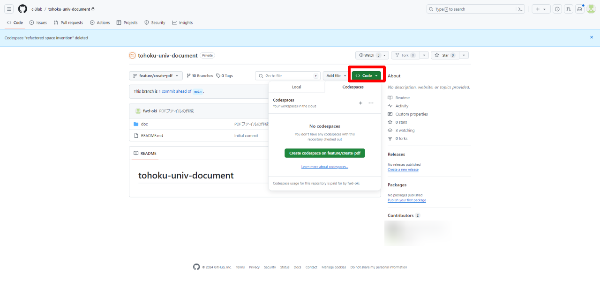
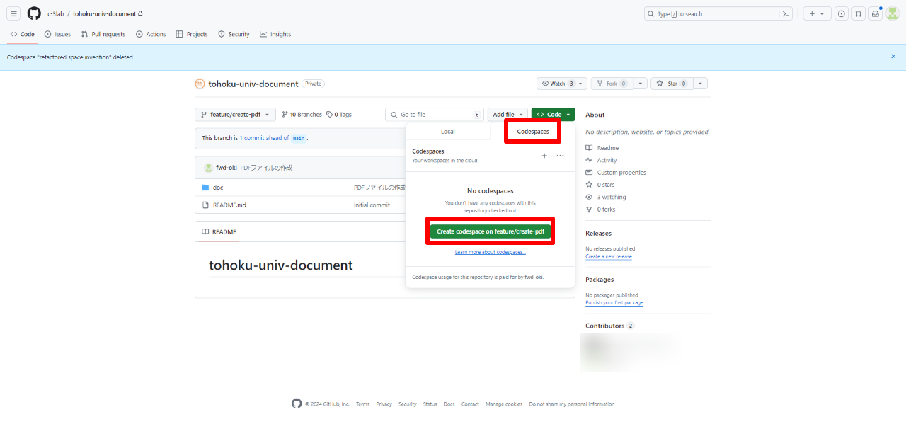
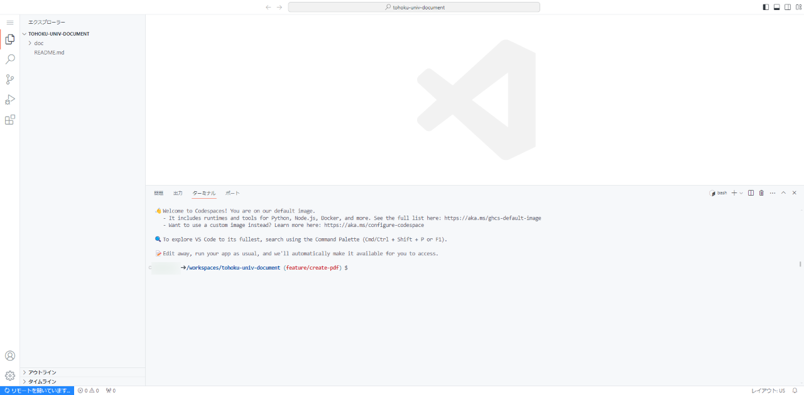
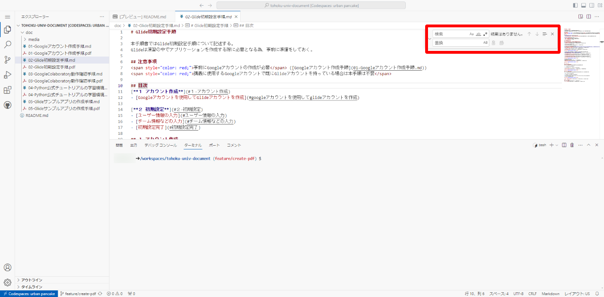
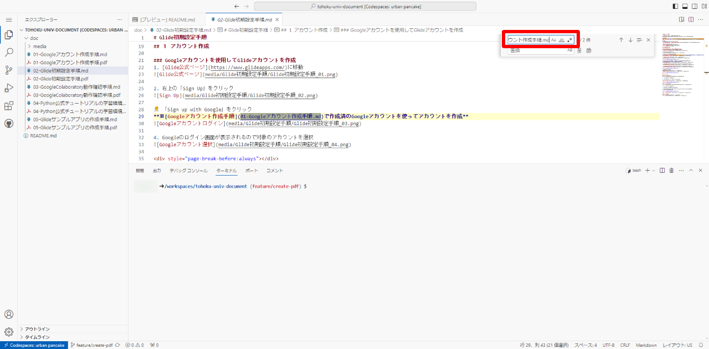
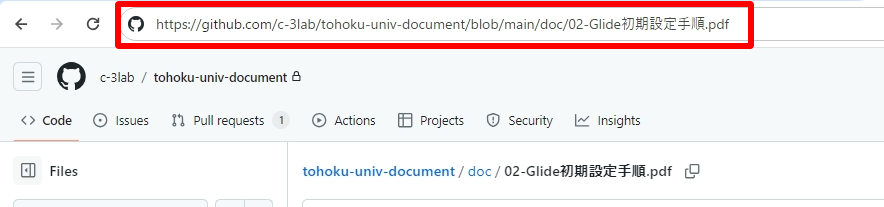
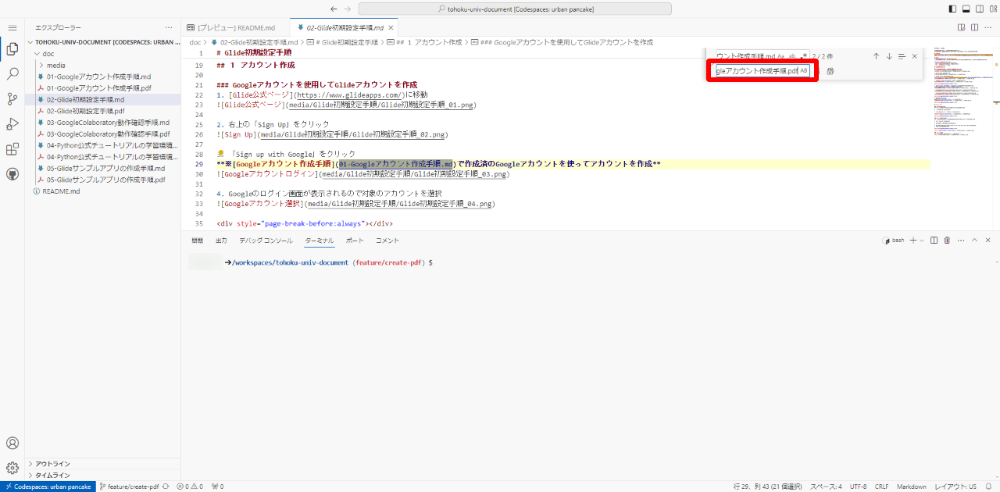
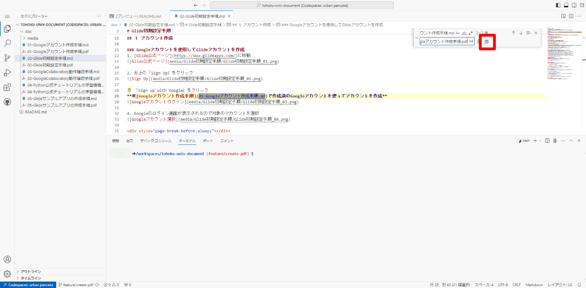
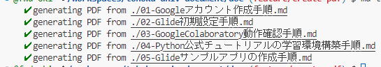

# PDF変換手順書

本手順書では、mdファイルをPDFに変換する手順を記載する。  

PDFへの変換は GitHub Codespaces を使用する為、事前にGitHubのアカウントを作成しておく。  

## 変換手順

1. PDF作成用のブランチに移動し、「Code」ボタンをクリック  
  

2. 「Codespaces」タブを選択し、「Create codespace on [ブランチ名]」をクリック
  

3. Codespace の VSCode が起動したことを確認  
  

4. 日本語フォントを表示させる為、フォントをインストール  
    ```
    sudo apt-get update
    sudo apt-get install texlive-lang-japanese texlive-latex-extra
    ```

5. package(md-to-pdf) のインストール  
    ```
    npm i -g md-to-pdf
    npm i -g md-to-pdf@latest
    ```

6. PDFへ変換すると、別mdファイルへのリンクが正常に機能しなくなる為、GitHubのリポジトリを参照するように修正  
※2024/3/27時点では「02-Glide初期設定手順.md」のみが対象  

    1. 「02-Glide初期設定手順.md」を選択する  
    2. VSCodeのエディタをアクティブにした状態で「Ctrl + h」を押すと検索置換ダイアログが表示される  

          

    3. 検索文字列に「01-Googleアカウント作成手順.md」を指定する  

          

    4. mainブランチの対象ファイルを開き、URLをコピーする  

          

    5. 置換文字列に「4」でコピーしたURLを指定する  

          

    6. 全置換を実行  

          

7. ターミナルに、以下のPDF変換コマンドを入力  
    ```
    cd doc

    // 1ファイルのみを変換する場合
    md-to-pdf 01-Googleアカウント作成手順.md

    // 複数ファイルを一括で変換する場合
    md-to-pdf ./*.md
    ```

8. 変換が完了すると以下が出力される  
  

## 補足

### PDFのスタイル変更

mdファイルの最初に以下のように記載することで生成されるPDFのスタイルを調整することが可能  
以下の例では、PDFサイズをA4、マージン10mm、フォントサイズ16px、画像の最大幅600px、画像の最大高さ400pxを設定している。  
詳細については[こちら](https://www.npmjs.com/package/md-to-pdf#user-content-options)を参照。
```
---
pdf_options:
  format: A4
  margin: 10mm
body_class: markdown-body
css: |-
  .markdown-body { font-size: 16px; }
  .markdown-body img {
    max-width: 600px;
    max-height: 400px;
  }
---
```

### 改ページ方法
任意の場所で改ページをいれたい場合は、mdファイル内に以下を記載する。  
```
<div style="page-break-before:always"></div>
```
